# Linux uchun ajratilgan disk xotirasini qanday qilib kengaytirish mumkin?

Holat: sizning kompyuteringizda _dual boot_ o'rnatilgan, ya'ni oddiy qilib aytganda bitta kompyuterga 2 ta operatsion tizim o'rnatilgan. Aytaylik, bittasi windows, ikkinchisi linux. Vaqtida siz linux uchun ajratgan disk xotirasi endi to'lishni boshladi. Windows uchun ajratilgan diskda esa ortiqcha xotira mavjud, shuning biroz qismini qanday qilib linux diskiga o'tkazib, uni kengaytirish mumkin?

  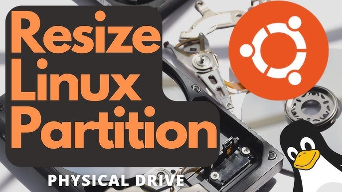

O'ylayotgan bo'lsangiz kerak: "Shu disk xotirasini kompyuterimda o'rnatilgan linux yoki windowsning ichidagi disk boshqaruvi (disk management) qismi orqali shundoq kengaytirsam bo'lmaydimi?", deb. Javobi: yo'q! Nega desangiz, siz hozir o'zingiz ishlatib turgan diskdan turib uni kengaytirishga urinmang, sababi bu sizning diskingizdagi ma'lumotlarning yo'qolishiga sabab bo'ladi.

> Faqatgina kamaytirishda _disk management_ orqali qilishingiz mumkin, faqat diskingizda mavjud bo'sh joydan ko'proqqa kamaytirishga urinmasangiz bo'lgani va biroz bo'sh joy qoldirishingiz ham tavsiya etiladi. Shunda hech qanaqa ma'lumotlaringiz yo'qolmaydi.

Xo'sh, kengaytirishdagi ushbu muammoni qanday qilib hal etish mumkin?

> _Bu uchun bizga kerak bo'ladi: oyim, non va chocotella... Hazil😄_

Biz o'zimiz ishlatib turgan disklarga zarar yetkazmaslik uchun vaqtinchalik boshqa diskdan foydalanishimiz kerak, bunga aynan USB xotira misol bo'la oladi va bu USB xotiraning o'zini ulaganimizda uning o'ziga qo'shimcha operatsion tizim o'rnatilgan bo'lishi lozim, ya'ni sizga **bootable USB drive** kerak bo'ladi. Buni qanday ketma-ketlikda amalga oshirishni esa bundan oldingi [maqolamda](https://zayniev.uz/article.html?article=operatsion-tizim-usb-xotiraga-qanday-qilib-yuklanadi.md) to'liq ko'rsatib o'tganman. Bu istalgan OT bo'lishi mumkin, men esa namuna uchun linux ubuntu 20.04 o'rnatganman. O'qib siz ham operatsion tizim o'rnatilgan USB xotiraga ega bo'lishingiz mumkin.

Bunday USB disk hosil qilganimizdan so'ng, endi ishga o'tamiz:

1. USB xotirani kompyuterga ulaymiz va uni qayta ishga tushiramiz (restart).

2. Yangi diskdagi OT'ni ishga tushirish uchun kompyuter yonib o'zidagi (default) OT'ni ishga tushirishidan oldinroq f9 yoki f10 (brand'larga qarab bir-biridan farq qilishi mumkin, HP uchun f9, misol uchun)larni bosib _boot device menu'ni ochishingiz kerak bo'ladi._

3. Ochilganidan so'ng ro'yxatda sizning ichiga OT o'rnatilgan USB disk xotirangiz chiqadi va uni tanlaysiz (Bu yerda uchinchisi):

  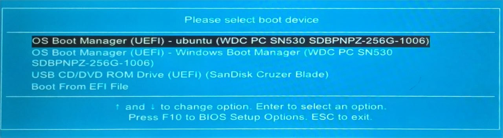

4. Boshqa oyna ochiladi va eng birinchi turgan (default) _\*ubuntu_ nitanlaysiz:

  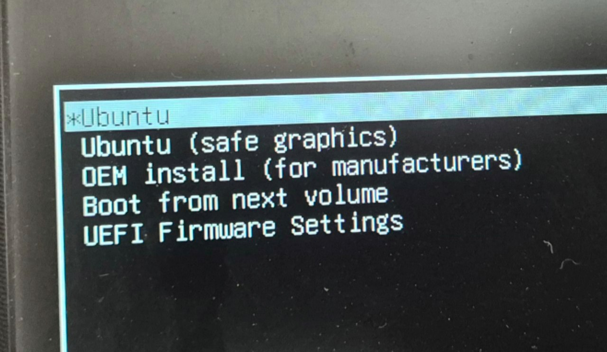

5. OT ning yuklanishini kutasiz va ushbu oyna chiqqanda, 'Try Ubuntu' orqali davom etasiz:

  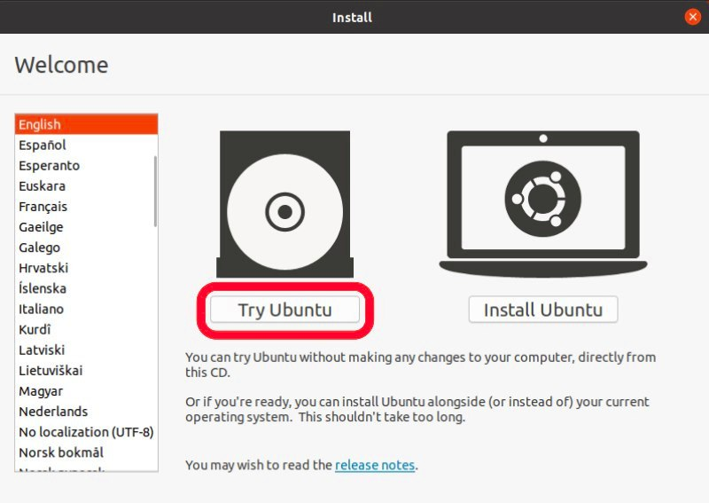

6. OT ishga tushganidan keyin ilovalar ro'yxatidan **GParted**ni qidirasiz, bizda disk xotirasini kengaytirishda shu ilova yordam beradi:

  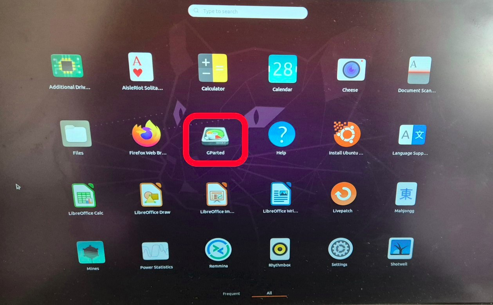

Agar bu ilova (by default) o'rnatilmagan bo'lsa, uni Ubuntu Store'dan topishingiz mumkin:

  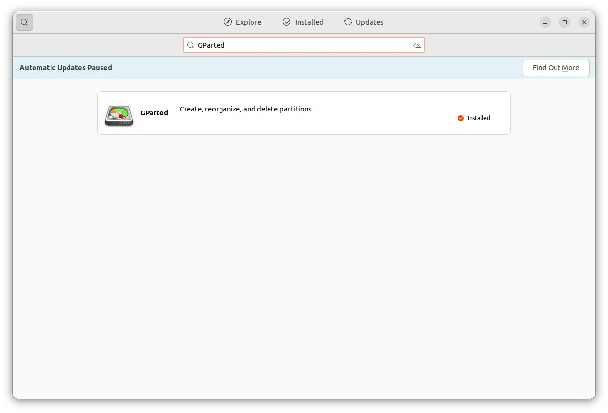

7. GParted ochildi, ushbu holatda bitta yaxlit 256 GB SSD xotira 8 ta qism(partition)ga bo'lingan, 2 tasi (3 va 4)windows uchun, qolganlari esa Linux Ubuntu uchun ajratilgan. Ko'rib turganingizdek, eng pastdagi qism(8) home uchun ajratilgan va deyarli to'lay deb qolgan. Windows operatsion tiziming o'zi uchun ajratilgan qism(3) da esa 20 Gb dan ortiq joy bor, demak shundan ozgina olsak bo'ladi.

  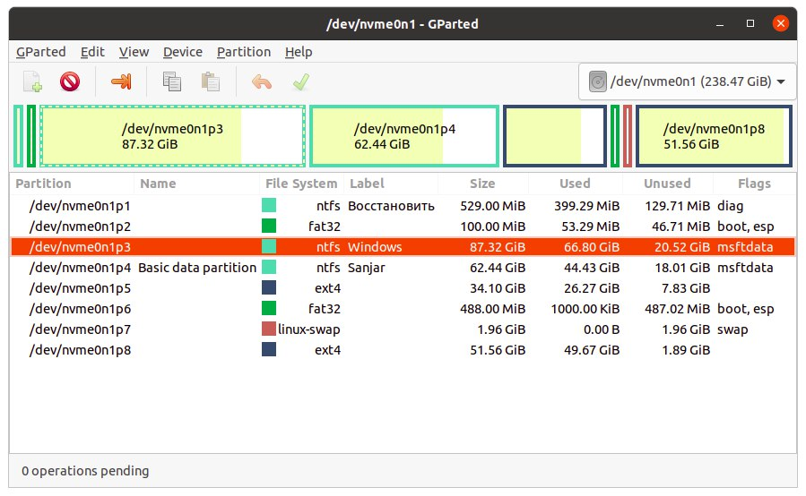

8. Belgilangan partition'ning ustiga o'ng taraf bilan bosamiz, keyin esa 'resize/move' tanlanadi:

  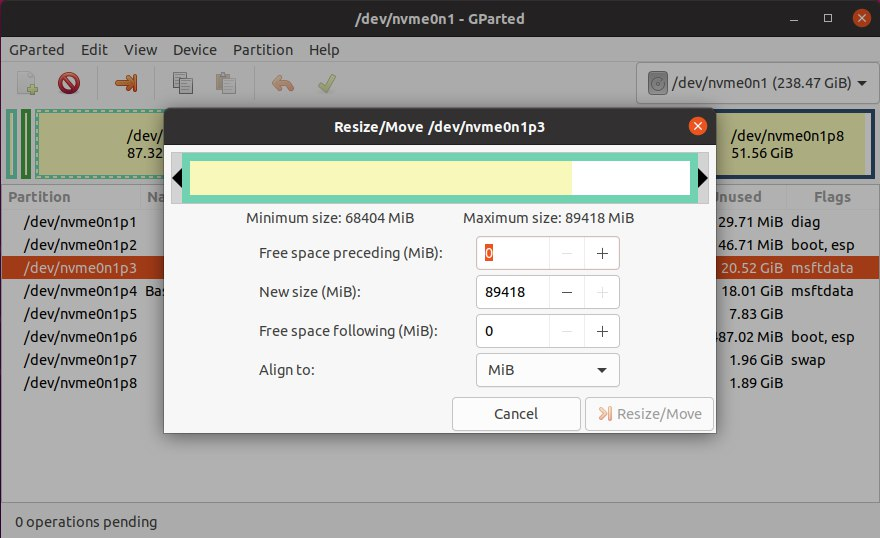

  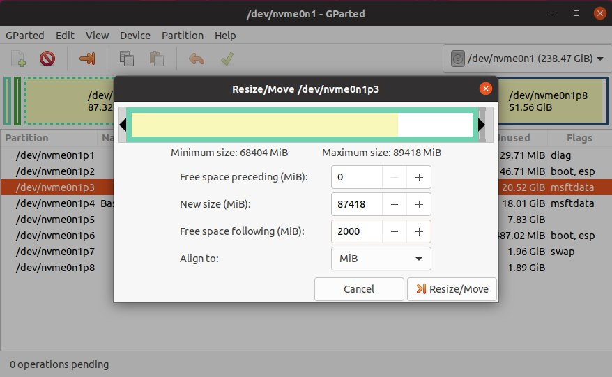

'Free space following' ga 2000 kiritamiz, shunchaki misol uchun

9. Ko'rib turganingizdek 2 GB bo'sh xotira ajraldi, endi buni eng pastgacha tushirishmiz kerak. Chunki mana shu (unallocated) xotira kengaytirmoqchi bo'lgan disk qismimizning eng oldida qo'shinisi sifatida turishi lozim. Buni pastga tushirish uchun quyidagi ketma-ketliklarni bajaramiz:

  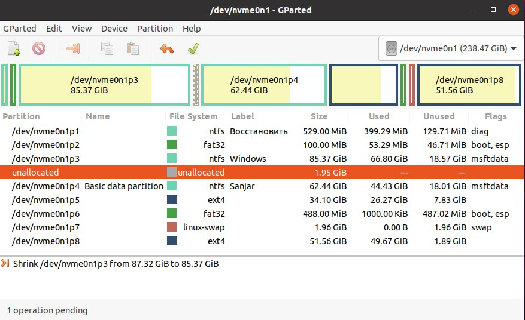

* (unallocated) qismdan bitta pastdagi qismni ham o'ng tomonn bosish orqali Resize/Move qilamiz:

  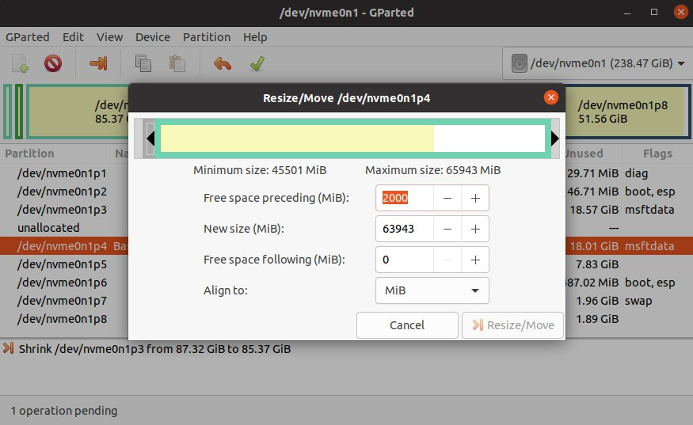

* Mana shu gorizontal bar'ni shundoq ushlab chap tarafga suramiz, Resize/Move bosiladi:

  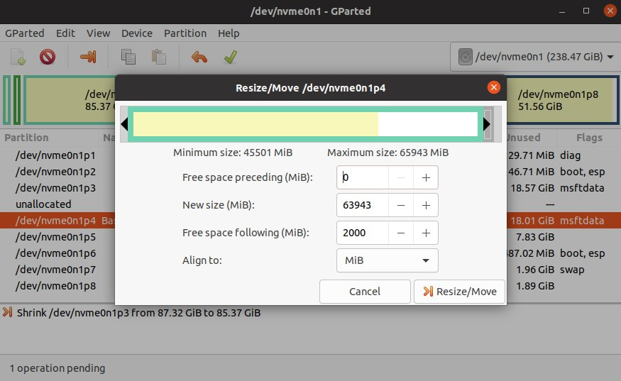

* Natijada (unallocated) qism bitta pastga tushadi:

  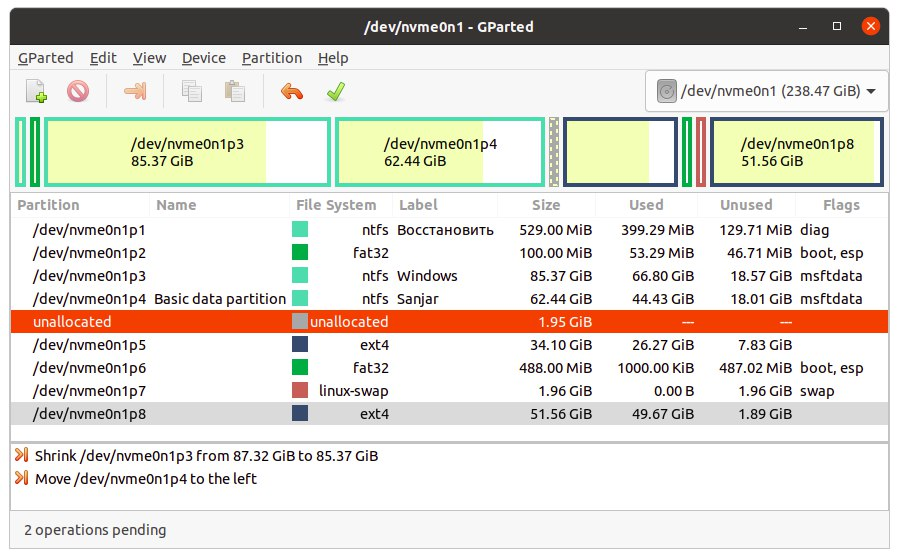

Xuddi shu yuqoridagi 2 ta qadam qayta-qayta davom etsa, (unallocated) qism bizga kerakli bo'lgan joyga tushadi:

  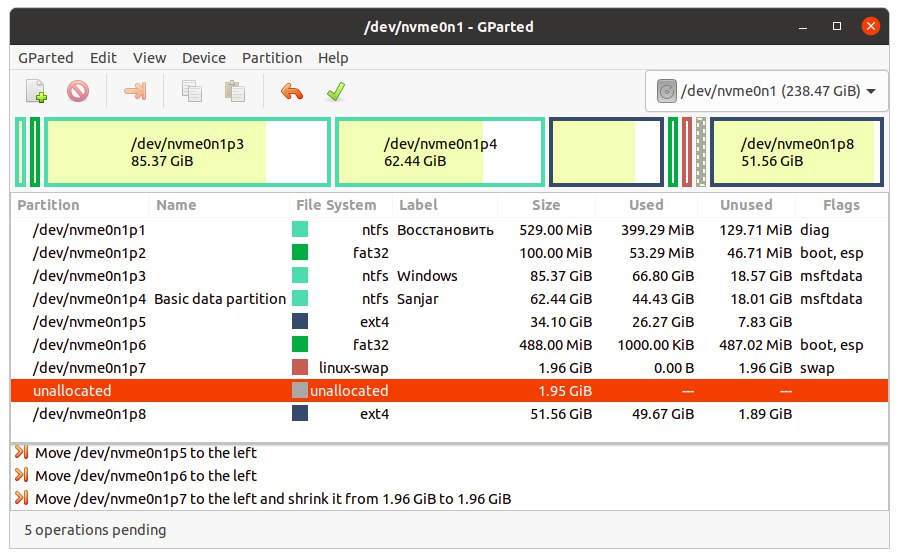

10. Endi esa biz kengaytirishni xohlagan disk(eng pastdagi)ning ustiga yana o'ng taraf bosilib, Resize/Move qilinadi:

  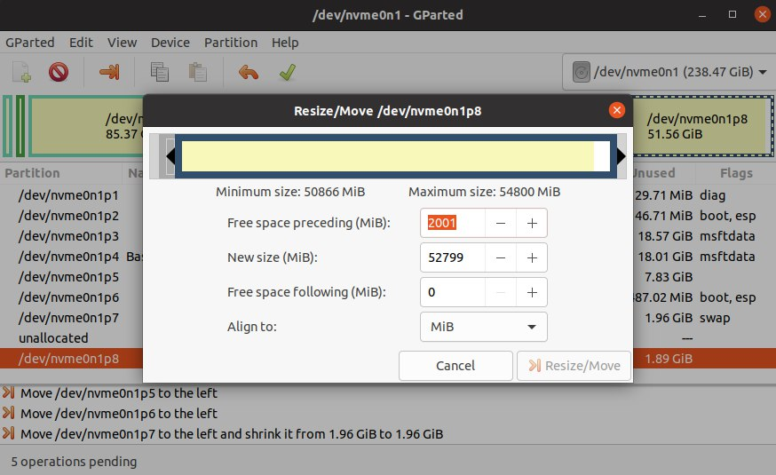

Endi esa 'free space preceding'ning o'rniga 0 kiritsak yoki o'sha gorizontal barning chap tarafidan ushlab oxirgacha surib, Resize/Move qilsak kifoya:

  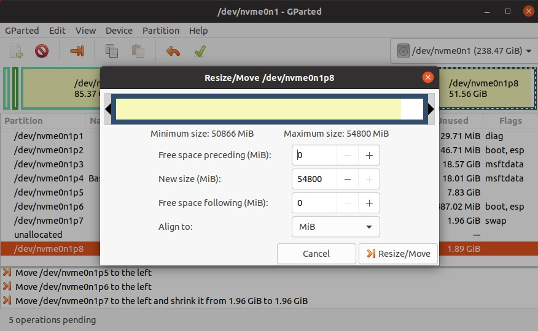

11. Yuqorida turgan ✅ bosiladi va ozgina (balki anchagina) kutasiz:

  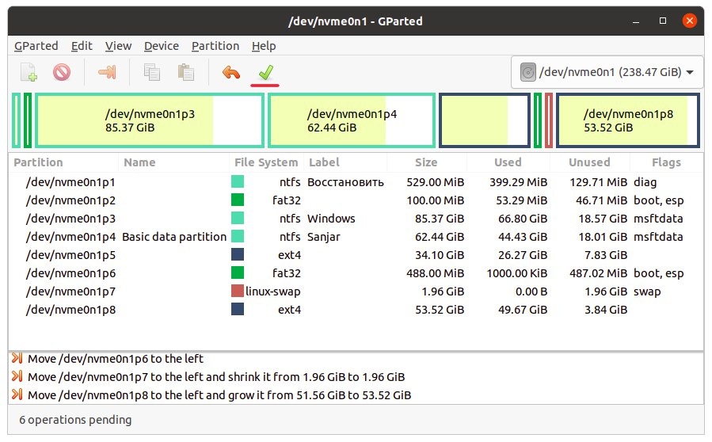

  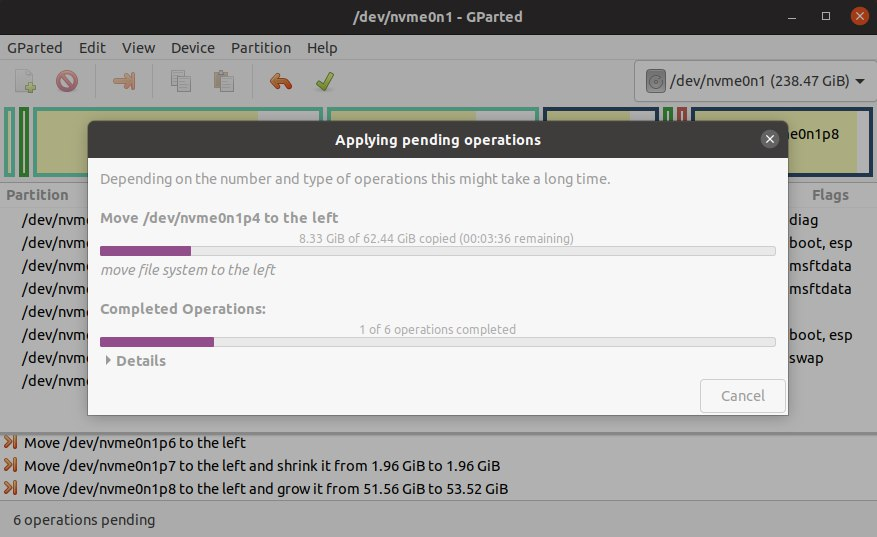

Kutish jarayoni, qilgan o'zgarishlaringizga qarab vaqt oladi

12. Tugallangandan so'ng, sizda o'sha disk kengaygan holatda bo'ladi:

  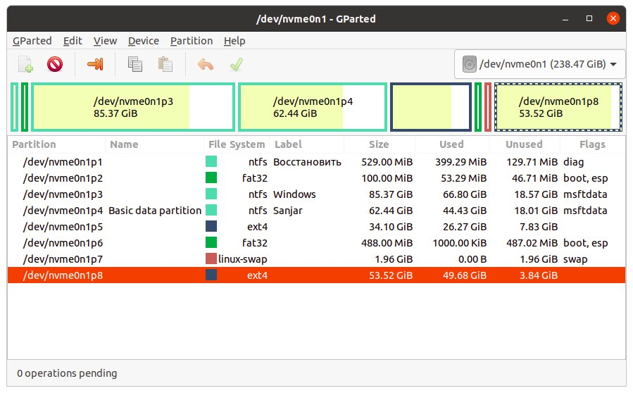

Endi eson-omon, bu vaqtinchalik diskdagi OT'ni tark etib uyimizga yetib olsak bo'ldi. Kompyuterni qayta ishga tushirish(restart) yoki o'chirishni bosganingizdan keyingina USB xotirani uzasiz. Teskarisini qilsangiz nima bo'lishi haqida bundan avvalgi maqolada aytganman.

Agar ushbu maqola kimgadir foydasi tegsa, xursand bo'laman. Rahmat :-)
