# Operatsion tizim USB xotiraga qanday qilib o'rnatiladi?

Sizda USB xotira (fleshka) bor va siz unga o'zingiz xohlagan operatsion tizim(bundan keyin OT deb qisqartirib ketaman)ni yuklamoqchisiz. Xo'sh, bu qanday amalga oshiriladi?!

<p align="center">
  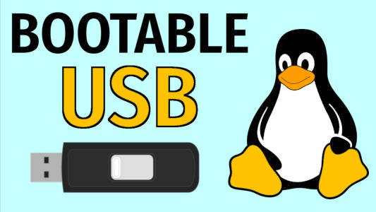
</p>

OT yuklangan xuddi shunday USB xotirani biz bootable USB deyishimiz mumkin.

Bunday bootable USB xotira quyidagi hollarda kerak bo'ladi:
* Qaysidir OT'ni o'rnatmasdan shunchaki sinab ko'rmoqchi bo'lganingizda;
* O'sha OT yoqib qolsa, kompyuteringizga o'rnatmoqchi bo'lganingizda;
* Kompyuteringiz _dual boot_ qilingan bo'lsa va siz qaysidir OT uchun ajratilgan disk xotirasi(disk partition)ni kattalashtirmoqchi bo'lganingizda.

> Kompyuteringizda agar bitta emas, ikkita OT o'rnatilgan bo'lsa, sizning kompyuteringiz **dual boot** qilingan bo'ladi.

Savol tug'ilishi mumkin, "USB xotiraning ichiga shunchaki .iso faylni tashlab qo'ysam, shuning o'zi yetmaydimi?" kabi. Yo'q, .iso faylning o'zi OT'ni yurg'iza olmaydi va bu fayl USB xotiraning ichiga joylanmasligi kerak!

> Istalgan OT'ning yuklanishi uchun kerak bo'ladigan dastkabki fayli(OS image) .iso ko'rinishida bo'ladi. Masalan, ubuntu-20.04.6-desktop-amd64.iso, Win10\_22H2\_English\_x64v1.iso kabi.

Aytaylik, siz USB xotirangizga Ubuntu 20.04 operatsion tizimini o'rnatmoqchisiz, bu uchun siz birinchi bo'lib, ushbu [link](https://releases.ubuntu.com/focal/ubuntu-20.04.6-desktop-amd64.iso) orqali .iso faylni yuklab olishingiz kerak. Agar boshqa ubuntu versiyasini o'rnatmoqchi bo'lsangiz, [bu](https://releases.ubuntu.com/) yerdan yuklab olishingiz mumkin.

> Ubuntuniki kabi .iso fayllarning hajmi katta bo'lganligi sababli, USB uchun talab etiladigan minimal xotira 8 GB. Agar eskiroq va kichikroq hajmdagi OT'ni o'rnatmoqchi bo'lsangiz, kam hajmli USB ham bo'ladi. Masalan, Terry Davis tomonidan yaratilgan TempleOS operatsion tizimi .iso faylini yuklab olish uchun 17.4 MB kifoya, lekin bunga o'xshash OT'larni zerikishdan o'rnatmasangiz, hech qachon ertalab turib, "bugun TempleOS o'rnataman" demasangiz kerak😁

Va endi bizga .iso faylni OT sifatida yurg'iza oladigan ko'rinishga keltirish uchun _balenaEtcher_ nomli kompyuter ilovasi kerak bo'ladi. Buni siz ushbu link orqali o'zingizdagi OT(Windows, Linux, MacOS)ga qarab yuklab olishingiz mumkin.

<p align="center">
  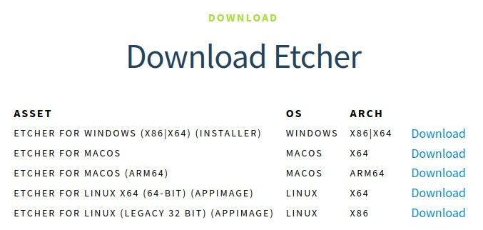
</p>

Windows va MacOS kabi OT'larda buni yuklab, o'rnatish oson bo'lgani uchun linux oilasiga kiruvchi OT tizimlar uchun qanday qilib o'rnatish ketma-ketligini ko'rsatib o'taman:

1. Terminalni ochib, o'sha .AppImage fayl yuklangan directory'ga kiramiz, odatda bu Downloads folder'i bo'ladi:

```bash
cd Downloads/
```

2. Endi biz bu faylga execute bo'lishga ruxsat berishimiz kerak, siz yuklab olgan vaqtingizda versiyasi yangilangan bo'lishi mumkin, hozir oxirgi versiya 1.19.21 ekan:

```bash
chmod +x balenaEtcher-1.19.21-x64.AppImage
```

3. Nihoyat, biz ilovani yurg'izishimiz mumkin:

```bash
./balenaEtcher-1.19.21-x64.AppImage
```

Ilova ochilganidan so'ng, keyingi qadamlar ancha oson kechadi:
<p align="center">
  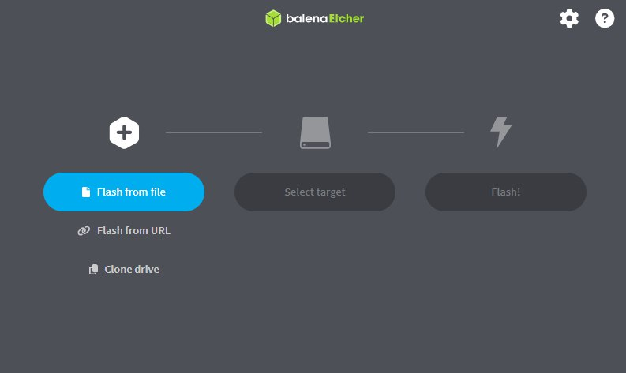
</p>

1. 'Flash from file' orqali .iso faylni tanlab olamiz;
<p align="center">
  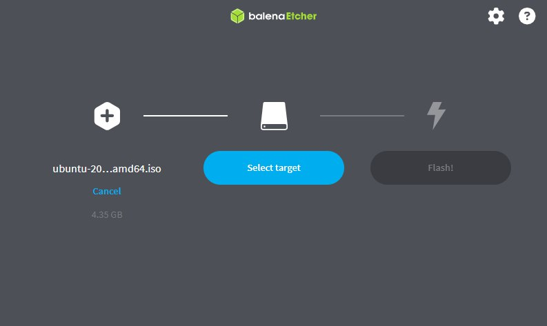
</p>


2. USB xotiramizni kompyuterga ulaymiz, undan oldin fleshkamiz formatlangan bo'lishi kerak, ya'ni ichi bo'sh bo'lishi lozim;
<p align="center">
  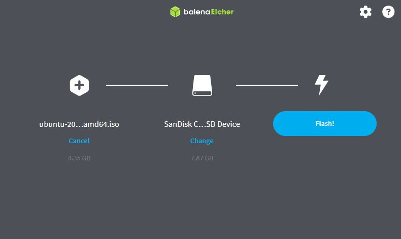
</p>

3. Endi esa 'Flash' orqali xotiramizni bootable qilishimiz mumkin, bu uchun ozgina(anchagina) kutamiz;
<p align="center">
  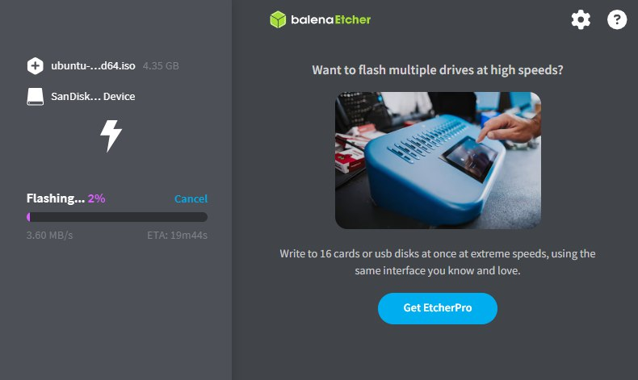
</p>

4. Validatsiyadan o'tadi;
<p align="center">
  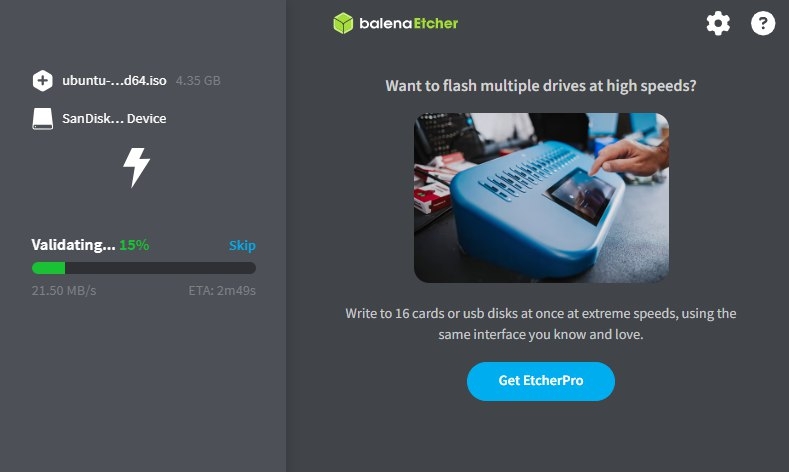
</p>

5. Va sizda endi bootable USB xotira mavjud!🎉
<p align="center">
  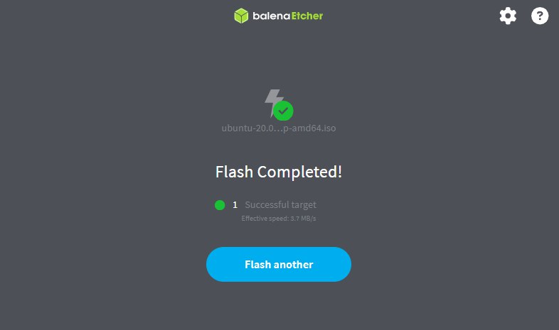
</p>


Endi esa bundagi OT'ni qanday qilib ishga tushirish mumkin? 'Boot menu' orqali, ha shunday! Buni quyidagi ketma-ketlik bo'yicha bajarishimiz mumkin:

1. USB xotirangizni kompyuterga ulang va qayta ishga tushiring(restart);
Va kompyuteringizda o'rnatilgan OT ishga tushishidan oldin darhol 'esc' (escape) tugmasini bir necha marta bosing, Shunda siz quyidagi menyuga duch kelasiz, bu yerdan esa 'boot menu' ni tanlang. Bu hp noutbuklarida F9 ga to'g'ri keladi;<p align="center">
  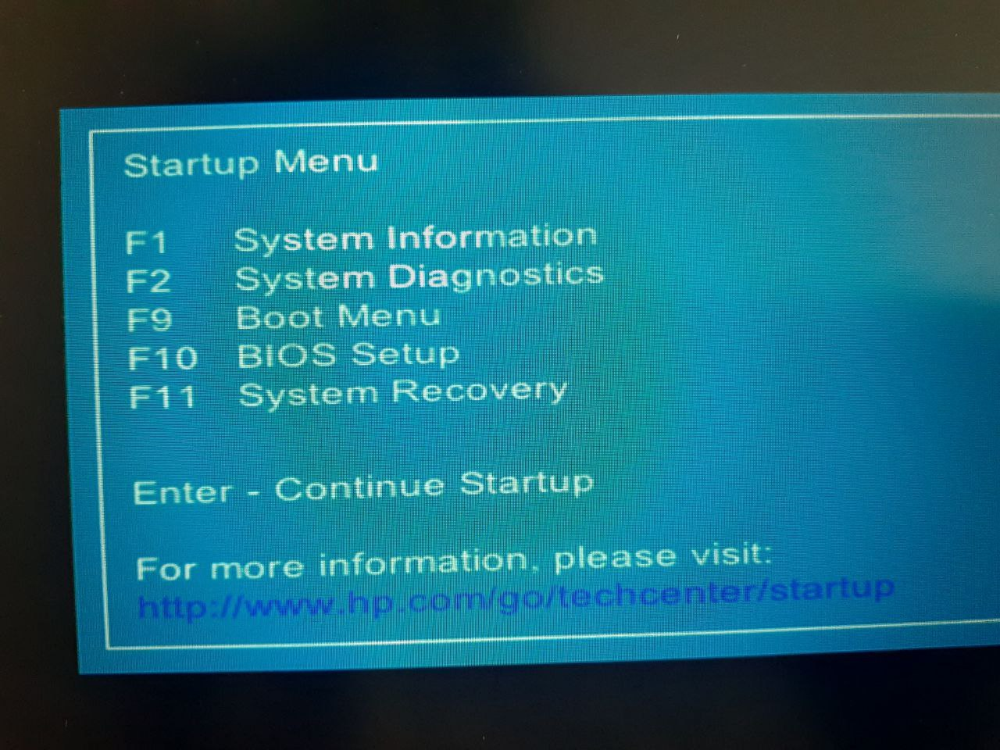
</p>

2. Boot menyuga kirgandan so'ng, o'zingizning USB xotirangizni topib tanlaysiz;
<p align="center">
  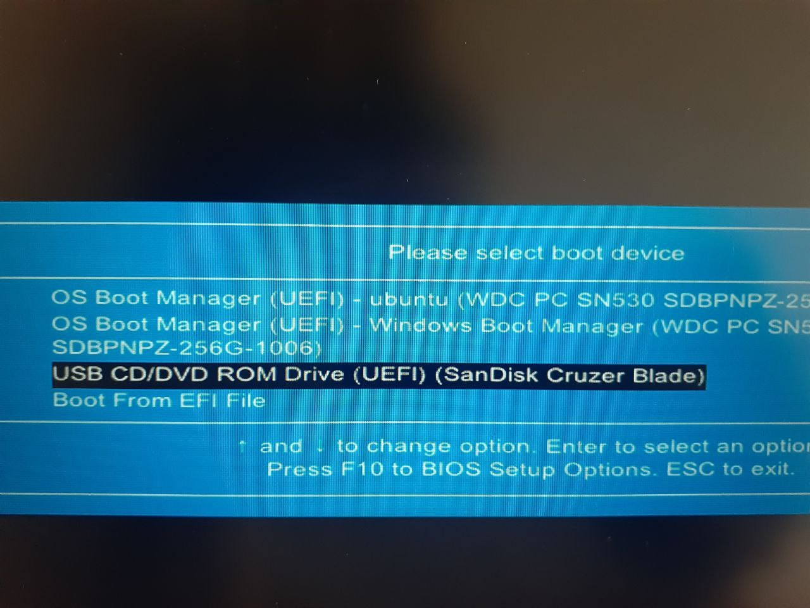
</p>

3. Keyin ubuntu'ni tanlab, OT'ni ishga tushiraverasiz;
<p align="center">
  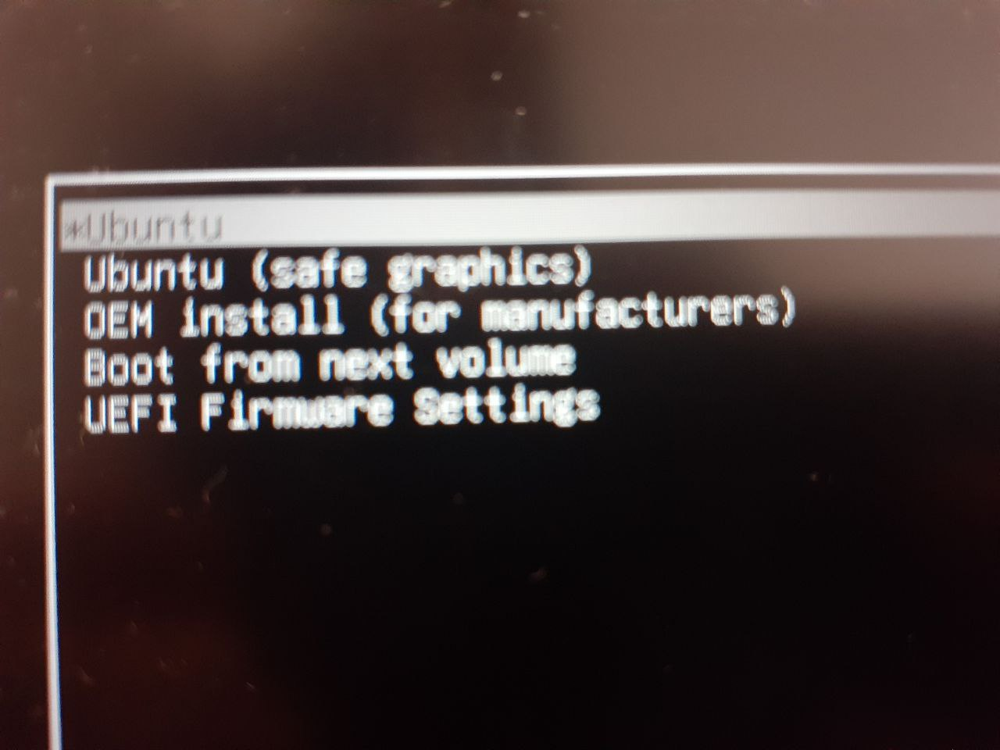
</p>

4. So'ngra, 'Try Ubuntu' orqali shunchaki o'zingizda bu OT'ni sinab ko'rishingiz yoki 'Install Ubuntu' orqali o'zingizga to'liq o'rnatishingiz ham mumkin;
<p align="center">
  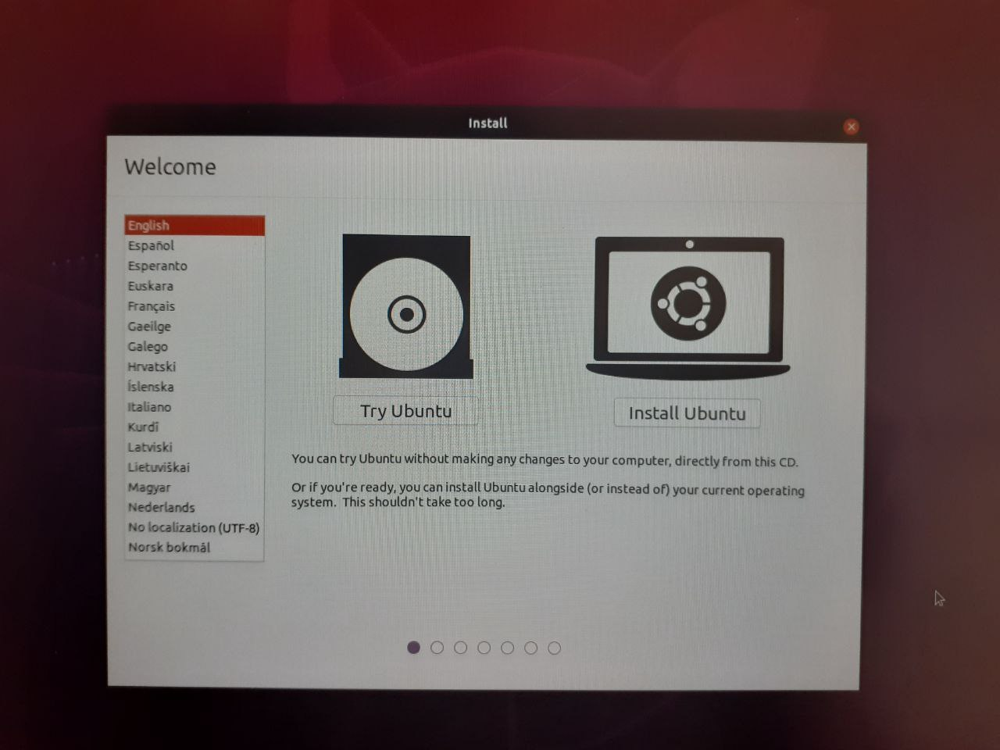
</p>


> Bundan chiqish uchun esa yana 'restart' qilgangizdan so'nggina, USB xotirani kompyuterdan uzishingiz mumkin, avval uzib keyin 'restart' qila ko'rmang, kompyuter 'segmentation fault' qaytaradi, xuddi Inhaning SP (System Programming) lab'laridagi kabi, mayli...

Bu maqolani yozishimdan sabab, keyingi safar linux disk xotiralarini uzaytirish haqida yoza olishim uchun edi, bu ham kattaroq qism bo'lgani uchun o'zini alohida qilib chiqara qoldim. Kimgadir foydasi tegsa, xursandman. Rahmat!
